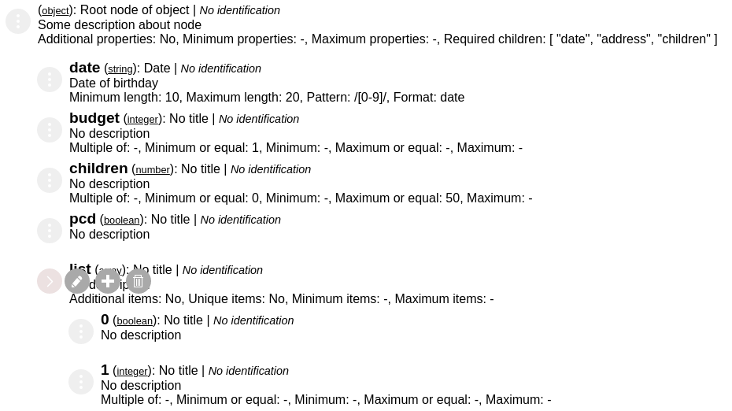

# Rubya

> Project destined to create json schema of visual form in vue.js

[](https://badge.fury.io/js/rubya)
[](https://travis-ci.org/bertoni/rubya)
[](https://codecov.io/gh/bertoni/rubya)


*A tribute for my Pug Rubya*

Constructed for you make one [Json Schema](https://json-schema.org/) in a visual mode, in an easy and fastly way, without know the Json Schema rules.

## Install
```shell
npm install --save rubya
```
or
```shell
yarn add rubya
```

## Quick Start

### Import the component
``` javascript
import Vue from 'vue'
import Rubya from 'rubya'

Vue.use(Rubya)

```

### Integrate with your component
#### In your template
``` javascript
<template>
  <div id="app">
    <Rubya
      ref="Rubya"
      :schema="schema"
      @updated-schema="updatedSchema" />
  </div>
</template>
```
#### In your script
``` javascript
<script>
import Rubya from 'rubya'

export default {
  name: 'App',
  components: {
    Rubya
  },
  data () {
    return {
      schema: {
        '$schema': 'http://json-schema.org/draft-07/schema#',
        '$id': 'http://example.com/product.schema.json',
        'title': 'Root node of object',
        'description': 'Some description about node',
        'type': 'object',
        'required': [],
        'properties': {
          'date': {
            'type': 'string',
            'title': 'Date',
            'description': 'Date of birthday',
            'minLength': 10,
            'maxLength': 20,
            'pattern': '/[0-9]/',
            'format': 'date'
          }
        }
      }
    }
  },
  methods: {
    printSchema () {
      this.$refs.Rubya.getJsonSchema()
    },
    updatedSchema (schema) {
      console.log(JSON.stringify(schema, null, 2))
    }
  }
}
</script>
```

#### Recover the updated schema
Call your method
``` javascript
printSchema () {
  this.$refs.Rubya.getJsonSchema()
}
```
After you will receive the schema in the method that you declare in the template
``` javascript
updatedSchema (schema) {
  console.log(JSON.stringify(schema, null, 2))
}
```

## How works


Use can use the [demo page](https://bertoni.github.io/rubya/index.html) to see how it works.

Every field has two options:
* Edit: enable you change the field properties
* Remove: enable you to remove this field

For the fields types object and array, have more one option:
* New: enable you add new child for this fields

Child fields will always be identified after their parents


## LICENSE
MIT
